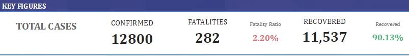
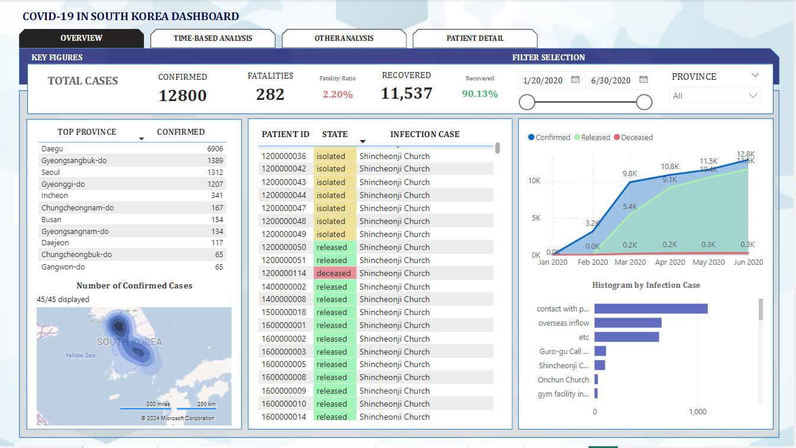
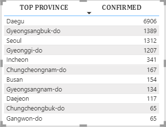
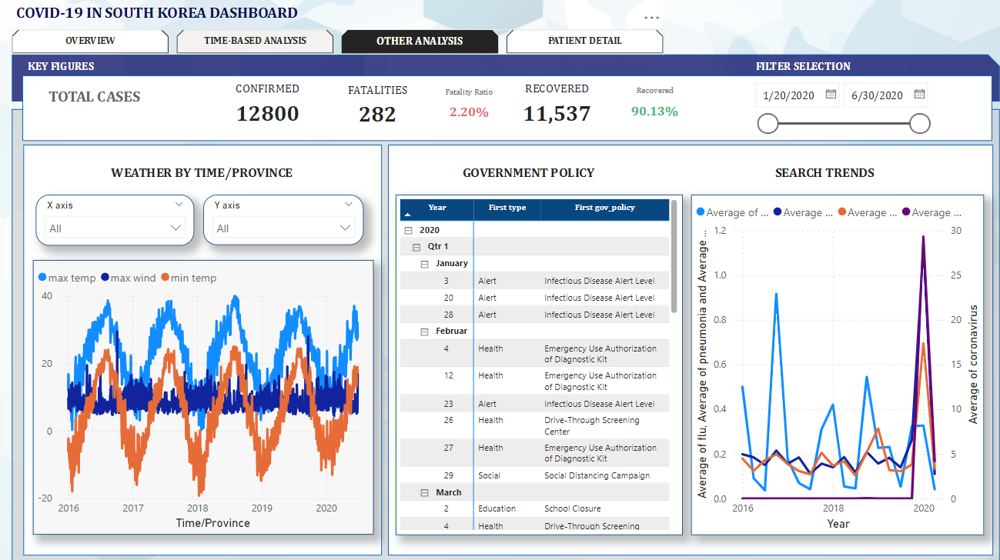
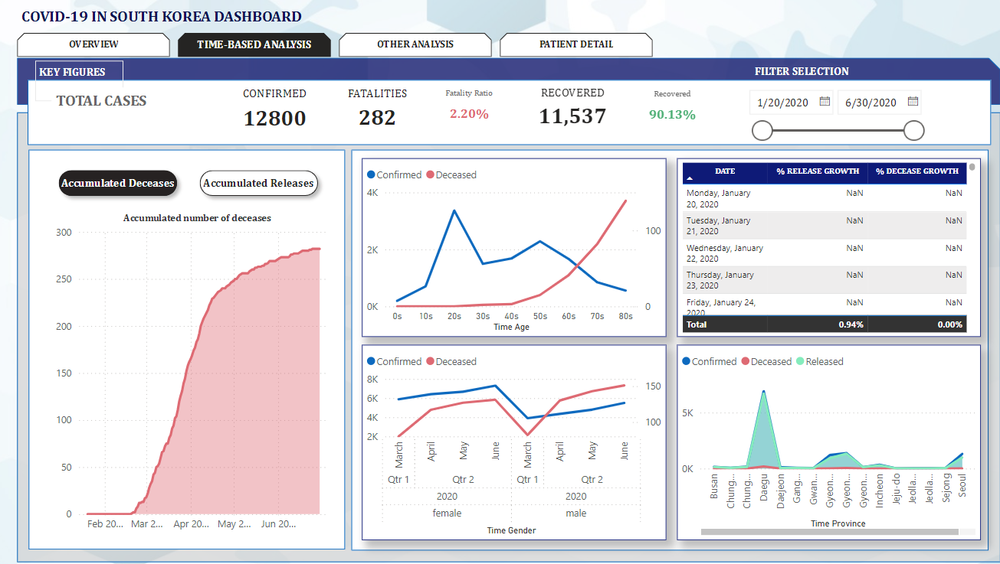
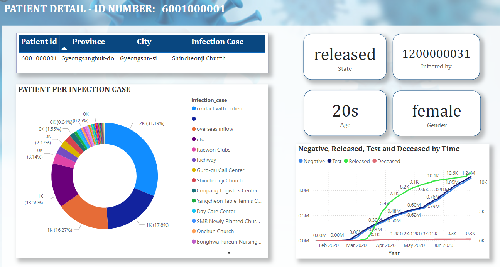
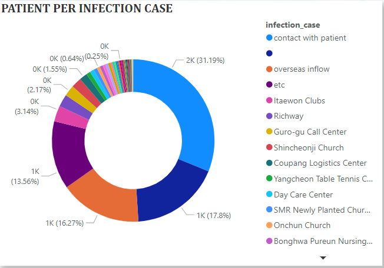

# COVID-19 Data Analysis in South Korea

This repository contains a Power BI report that analyzes COVID-19 data in South Korea. The report leverages DAX functions for in-depth calculations and visualizations to uncover trends in COVID-19 cases, fatalities, and vaccinations.
This repository is an analysis and visualization of COVID-19 Pandemic spread in South Korea from 01/20/2020 to 06/30/2020 by DS4C.
See this in [Kaggle](https://www.kaggle.com/datasets/kimjihoo/coronavirusdataset/data)

## Dataset
- Case.csv (Data of COVID-19 infection cases)
- PatientInfo.csv (Epidemiological data of COVID-19 patients)
- PatientRoute.csv (Route data of COVID-19 patients)
- Region.csv (Location and statistical data of the regions)
- SearchTrend.csv (Trend data of the keywords searched in NAVER which is one of the largest portals)
- SeoulFloating.csv (Data of floating population in Seoul, South Korea (from SK Telecom Big Data Hub))
- Time.csv (Time series data of COVID-19 status)
- TimeAge.csv (Time series data of COVID-19 status in terms of the age)
- TimeGender.csv (Time series data of COVID-19 status in terms of gender)
- TimeProvince.csv (Time series data of COVID-19 status in terms of the Province)
- Weather.csv (Data of the weather in the regions)

## 📊 Project Overview
**Card Visual**

 

This Power BI analysis provides insights into:
- **Daily and Cumulative Cases**: Trends in infection rates over time.
  
  **Overview**
  
   
  

- **Vaccination Progress**: Correlation between vaccination rates and case numbers.
- **Regional and Demographic Patterns**: Impact of COVID-19 across different regions and age groups in South Korea.

   

- **Other Analysis**

  

## 🔍 Key Insights

- **Case Trends**: Analysis of how case rates have changed by time.

   
  
- **Vaccination Impact**: Observations on vaccination progress and its effect on reducing cases and fatalities.
  
  
  
- **Regional Disparities**: Identification of regions with higher infection or vaccination rates.

  

## Tools and Techniques Used

- **Power BI**: Used for data visualization and reporting.
- **DAX (Data Analysis Expressions)**: Implemented for custom calculations, such as cumulative case counts, moving averages, and conditional measures for deeper insights.
## 📊 DAX Formulas Used

This project utilizes several DAX formulas to perform calculations and derive insights. Here are some key formulas implemented in the Power BI report:

### 1. PATIENT PER INFECTION CASE
```dax
PATIENT PER INFECTION CASE = CALCULATE(COUNTROWS(PatientInfo),ALL(PatientInfo))
```
### 2. % RELEASE GROWTH
```dax
% RELEASE GROWTH = (MAX('Time'[released]) - (CALCULATE(MAX('Time'[released]),DATEADD('Time'[date],-1,DAY))))/(CALCULATE(MAX('Time'[released]),DATEADD('Time'[date],-1,DAY)))
```
### 3. % CONFIRMED GROWTH
```dax
% CONFIRMED GROWTH = (MAX('Time'[confirmed])-[CONFIRMED PREVIOUS DAY])/[CONFIRMED PREVIOUS DAY]
```
### 4. % DEAD GROWTH
```dax
DEAD PREVIOUS DAY = CALCULATE(MAX('Time'[deceased]),DATEADD('Time'[date],-1,DAY))
% DEAD GROWTH = (MAX('Time'[deceased])-[DEAD PREVIOUS DAY])/[DEAD PREVIOUS DAY]
```
### 5. Fatality Ratio
```dax
Fatality Ratio = MAX('Time'[deceased])/MAX('Time'[confirmed])
```
...

## Project Files

- **COVID19_South_Korea_Analysis.pbix**: The Power BI report file.
- **README.md**: Documentation of the project.
- **screenshots/**: Images from the Power BI report.

## How to Use

1. Download the `.pbix` file.
2. Open it with Power BI Desktop.
3. Explore the various dashboards, visuals, and insights using the interactive features and filters.


Thank you for exploring this project! Stay informed and stay safe.

